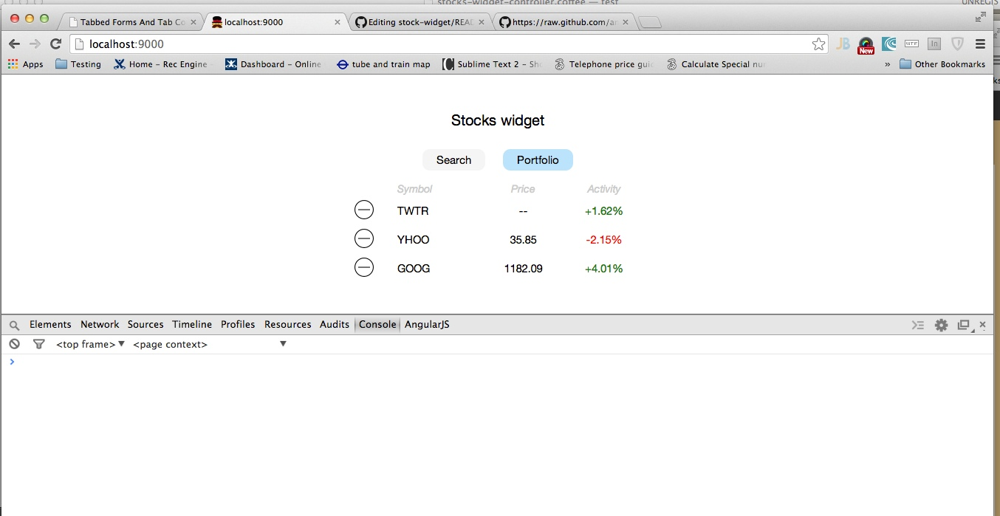

Toolchain
---------
Yeoman with the angular-generator for scaffolding - used these features: local dev server with Livereload (binds to port 9000), bower for client-side package management, jshint, the Grunt *grunt-contrib-watch* and *grunt-contrib-coffee* tasks for continuous deployment to local server.

Installed Testem (test runner) - runs as Grunt task, Jasmine as a testing framework. Worked mostly in a TDD fashion.

Running
-------
You need to run this on a machine that has Node installed. I've used v0.10.24 when developing, and tested only in Chrome.

```javascript
npm install
bower install
```

To run the unit tests: `grunt testem`. It sometimes has glitches - if 0 tests are loaded press return and you should see 12 tests loaded.

To run the server and see the widget: `grunt serve &` and point your browser to http://localhost:9000.


Design choices
--------------
Opted for Angular as MVC. CoffeeScript for the tests. SASS + Compass for CSS (see app/styles/main.scss).

The stock quotes service from Yahoo seemed the best choice for a quick start. However it is unreliable at times and may return an empty price. The suggested MarkitOnDemand service did not have the CORS headers set.

`localStorage` is used for persistence.

The aim was to decouple the parts of the system, "the Angular way". Two directives were created: `stocksWidget` and `stocksTable` (because it's layout that repeats in both panels - search and portfolio. The `stocksTable` has an isolated scope, and gets the aspect and behavior of the action icon as parameters.

The `portfolio` service is responsible for data persistence, and the `stocks` service will query the Yahoo service (forming a YQL query URL). The format for the query URL is separated into an angular constant.

These services are mocked in tests when they are not the SUT.

Quick reference: please see `/test/spec/` for the unit tests. JS code is in /app/scripts.


